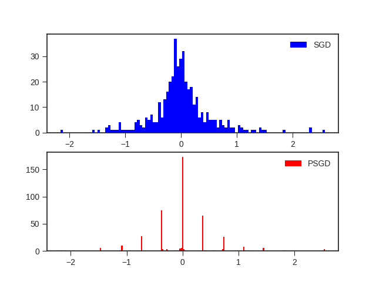

# Position-based Scaled Gradient for Model Quantization and Sparse Training (NeurIPS 2020)

This repository is the official implementation of [Position-based Scaled Gradient for Model Quantization and Sparse Training](). 

The source code is for reproducing the results of Figure 1 of the original paper and Table 1A of Appendix A.

>The repository provides the codes for training & visualization and pre-trained models.  

## Requirements

To install requirements using [environment.yml](environment.yml) refer to the [documentation.](https://conda.io/projects/conda/en/latest/user-guide/tasks/manage-environments.html#creating-an-environment-from-an-environment-yml-file)

```
torch=1.4.0
tensorboard=2.1.1
```

> Manually installing the above packages will also work. Some visualization packages (matplotlib and seaborn) are also needed for running [visualize.py](visualize.py).

## Training

[train.py](train.py) is the code for training  **with PSGD** after the first learning decay. To train the model(s) in the paper, run this command:

```train
python train.py --arch <choices=ResNet32, vgg16_bn> --seed <random seed> --cu_num <GPU_ID>
                --lr <learning rate> --epoch <terminating epoch> --decay_epoch <lr decay epoch> --adam <whether to use adam optimizer>  
                --w_bit <target weight bit-width> --lambda_s <lambda_s> --first_last_quant <whether to quantize fl> --a_bit <target activation bit (no effect in training)> 
                --load_pretrained <path to pretrained model>

#The results from the original paper can be reproducd by running : 
python train.py --arch ResNet32 --load_pretrained models/ResNet82.pth --lr 0.01 --epoch 150 --decay_epoch 123 --adam 0 \
                --w_bit 4 --lambda_s 150 --first_last_quant 1 --seed 1 --cu_num 0
```

> The code for training vanilla pre-trained model is not included, but the checkpoint file is provided.
> One can train from scratch or continue training from a vanilla model, which is the method used in the original paper. 
> 
>Please refer to the original paper and Appendix C for further training details. 
>
> Modification to DATASET_PATH in the source file may be needed. 

## Evaluation

To evaluate the model with specified bit-widths, run:

```eval
python eval.py --arch <choices=ResNet32, vgg16_bn> --model_path <path to model> --cu_num <GPU_ID>
               --w_bit <target weight bit-width> --a_bit <target activation bit> --lambda_s <lambda_s for recording> --first_last_quant <whether to quantize fl> 
               --act_quant <whether to quantize activation> --act_clipping <whether to clip activation range> --clipping_range <value of n for clipping>               

#The results from the original paper can be reproduced by running : 
python eval.py --arch ResNet32 --model_path models/W4_ResNet.pth --w_bit 4 --a_bit 4 --lambda_s 150 --first_last_quant 1 \
               --act_quant 0 --act_clipping 0 --cu_num 0
```

> When activation is also quantized, the best clipping range can be found on the training set. 
>For more details, please refer to Section 5 of [Data-Free Quantization Through Weight Equalization and Bias Correction](https://arxiv.org/abs/1906.04721).

## Pre-trained Models

We provide two pre-trained models:

- models/W4_ResNet.pth : PSGD-trained targeting 4-bit (150 epochs)
- models/ResNet150.pth : SGD-trained (150 epochs)
- models/ResNet82.pth : SGD-trained (82 epochs) used for training PSGD

> For more implementation details, please refer to Appendix A and Appendix C. 

## Results

For further details on other bit-widths refer to Table 1A of Appendix A :

### Accuracy on CIFAR-100

| Model         | Full precision  | W4A32  | 
| ------------- |---------------- | ------ |
| ResNet-32     |     70.08%      | 69.57% | 


## Visualizations

For visualizing the weight distributions, run [visualize.py](visualize.py).
> Change the paths in the source code for visualizing other models than the provided ones. 
> Defualt: 'visualizations/'

This will save figures of all convolutional layers of PSGD- and SGD- trained models of the provided pre-trained models in the 'visualizations' folder

<br/> 

## Citation
Please refer to the following citation if this work is useful for your research.

### Bibtex:

```
@article{kim2020position,
  title={Position-based Scaled Gradient for Model Quantization and Sparse Training},
  author={Kim, Jangho and Yoo, KiYoon and Kwak, Nojun},
  journal={arXiv preprint arXiv:2005.11035},
  year={2020}
}
```